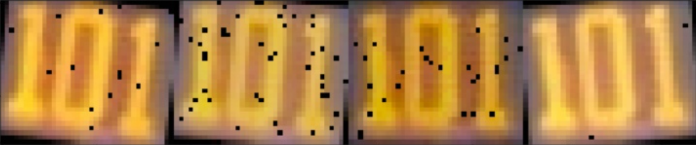
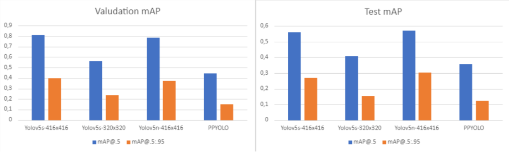
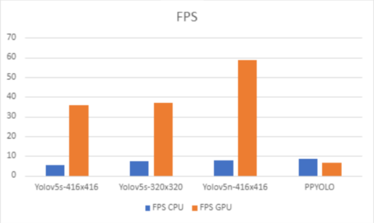
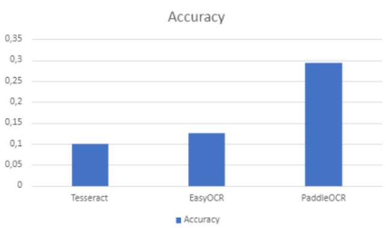
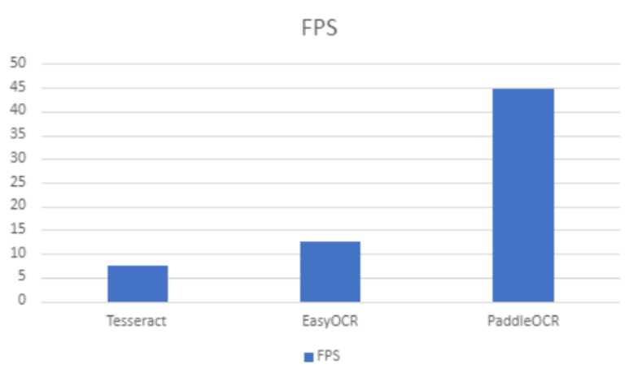

# RoutNumberRecognition
Мобильные приложение по детекции и распознаванию номера маршрута общественного транспорта в реальном времени.

## Demo

## Запуск мобильного приложения

apk файл необходимо [скачать](https://bit.ly/3ZG3MRd) и запустить на android устройстве:

**det.apk** — запускается на всех android устройствах без дополнительных действий, реализует только детекцию номера

**det_rec.apk** — требует размещения папки tessdata в память смартфона и открытие открыть доступа к управлению файлами устройства.

## Приложение

Приложение построено на основе API Tensorflow Lite, использует модель YOLOv5 и алгоритм распознавания Tesseract

Полный код с весами моделей доступен [здесь](https://bit.ly/3ILllIR).

## Данные

Для детекции собрано и размечено 535 изображений из открытых источников

## Результаты

Качество в итоговом продукте:
- Точность
  - Детекция: 0.55 mAP
  - OCR: 10% acc.
- Скорость
  - Детекция: 59 FPS
  - OCR: 7 FPS

### Результаты исследования

Рассматривались 
- Модели детекции: Yolov5 и PP-Yolo. 
- Модели OCR: Tesseract, EasyOCR, PaddaPaddleOCR

### Точность моделей детекции (mAP)

### Скорость моделей детекции (FPS)

### Точность моделей OCR (Accuracy)

### Скорость моделей OCR (FPS)

### Вывод

* **Почему использовался Tesseract, а не EasyOCR, PaddaPaddleOCR?** — Tesseract имеет API для взаимодействия с android устройством, а EasyOCR, PaddaPaddleOCR доступны только для распознавания с ПК
* **С чем связано низкое качество модели расознавания?** — Недостаточное количество данных, изображение с номером маршрута низкого качества, 15-30 пикселей, нет предобученных моделей для таких данных, особенно для русского корпуса с цифрами
* **Можно ли использовать приложение в дальнейшем?** — Качество детекции в реальном времени все ещё неплохое, при большем количестве данных и дообучении приложение можно выпускать в мир
