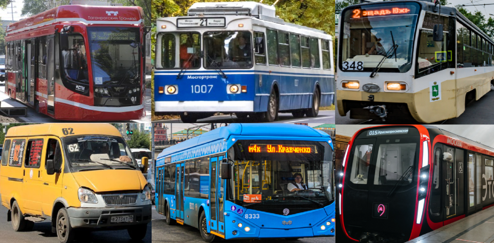

# RoutNumberRecognition
Репозиторий содержит основные java файлы описывающие мобильные приложение по детекции и распознаванию номера маршрута общественного транспорта в реальном времени. А также ipynb ноутбуки подтверждающие результаты исследования.

Приложение построено на основе API Tensorflow Lite позволяющее импортироть модели машинного обучения в андройд приложение.

Весь код находится по следующей ссылке на Google диске: https://drive.google.com/drive/folders/1m9HZqz08ozcKx8-zpzgFosAMZyg7wALs?usp=sharing

Запустить мобильное приложение можно скачав apk файлы по ссылке: https://drive.google.com/drive/folders/1SAHTLIRTqNyiNtDYmGqthfUDgK7GbIiV?usp=sharing

Мобильное приложение содержит алгоритм использующий модель Yolov5 и алгоритм распознавания Tesseract поддерживающий Java реализацию.

## Запуск мобильного приложения

Файл det.apk запускается на всех андройд устройствах без дополнительных действий со стороны пользователя, он содержит только алгоритм по детектированию номера

Для корректного запуска файла det_rec.apk нужно разместить папку tessdata во внутренний общий накопитель устройства, то есть в основную память смартфона, а также открыть доступ к управлению файлами устройства.

## Demo

## Исследование методов и алгоритмов быстрого распознавания номера маршрута приближающегося общественного транспорта

Модели детекции: Yolov5 и PP-Yolo. Модели OCR: Tesseract, EasyOCR, PaddaPaddleOCR

## Данные

Для детекции собрано и размечено 535 изображений из открытых источников где выделен объект и для оптического распознавания текста на этих же изображениях размечен номер маршрута

## Результаты
### Точность моделей детекции (mAP)

### Скорость моделей детекции (FPS)

### Точность моделей OCR (Accuracy)

### Скорость моделей OCR (FPS)

